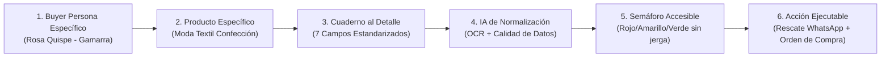

# Tinkuy IA — De cuaderno a decisión, en 3 pasos 🚀

> **Plataforma de gestión visual de inventario e inclusión financiera para microemprendedoras.**  
> Basada estrictamente en el Pitch Deck oficial y en las resoluciones a los jurados (Gobernanza de Datos, Multitienda Gamarra, IA Operativa y Unit Economics).

---

## 🌟 Arquitectura del Proyecto (Clean Architecture & Modular Frontend)

Diseñado con **HTML5 semántico, Tailwind CSS y JavaScript ES Modules nativo**, listo para subirse y publicarse en **GitHub Pages** sin requerir comandos de compilación (`npm build`) ni configuraciones de servidor.

```text
tinkuyIA/
├── index.html                   # Vista principal interactiva y semántica (Desktop & Móvil)
├── assets/
│   ├── css/
│   │   └── styles.css           # Tokens de diseño, variables de color y animaciones
│   └── js/
│       ├── models/
│       │   ├── Product.js       # Entidad Producto con Gobierno de Datos y validaciones
│       │   ├── Store.js         # Entidad Tienda para soporte multitienda (Gamarra)
│       │   └── PurchaseOrder.js # Entidad Orden de Compra formal para proveedores
│       ├── data/
│       │   └── mockData.js      # Datos semilla iniciales (textil, abarrotes, bazar)
│       ├── services/
│       │   ├── StorageService.js# Abstracción de persistencia local (LocalStorage)
│       │   ├── OcrEngine.js     # Simulación de Visión Multimodal y Data Quality Score
│       │   ├── TrafficLightService.js # Lógica del Semáforo del Dinero y Modelo ABC
│       │   ├── PosterService.js # Renderizado en HTML5 Canvas y copies persuasivos
│       │   ├── FinancialScoreService.js # Algoritmo de Tinkuy Score B2B (0–1000)
│       │   └── EconomicsService.js # Unit Economics, COGS, OPEX y valor por hora
│       └── app.js               # Controlador maestro de eventos y vistas
├── Tinkuy_IA_Pitch_Deck (2) (1).pdf # Pitch Deck oficial
└── README.md                    # Documentación del sistema
```

---

## 📋 Mapeo Técnico: Respuestas al Feedback de los Jurados

### 1. Jurado 1: Gobernanza de Datos & Supresión de Sesgos
- **Taxonomía Mínima Estandarizada:** Cada registro captura obligatoriamente: *Categoría, Modelo, Variantes (Talla, Color, Material), Costo Unitario, Precio de Venta, Días de Permanencia y Stock Físico*.
- **Data Quality Score (96%):** La IA evalúa la confiabilidad del dato antes de calcular métricas de rotación.
- **Human-in-the-Loop:** Si un número manuscrito es dudoso, la app no inventa datos; consulta a la emprendedora para confirmar o activa el **Audio de Rescate por voz**.
- **Sin Sesgos de Instrucción:** Se reconoce el dinamismo de las mypes; la herramienta se centra en el volumen de ventas y no asume falta de capacidades tecnológicas.

### 2. Jurado 2: Multitienda, IA Operativa & Unit Economics
- **Soporte Multitienda (Gamarra):** Selector de sucursales (*Galería Guisado #104*, *Galería El Rey #215*, *Almacén Central*) + **Vista Consolidada del Negocio**.
- **Roles:**
  - **Dueña:** Vista estratégica consolidada, autorización de compras, finanzas y scoring bancario.
  - **Vendedora:** Modo "Cuaderno Rápido" para registrar ventas del puesto y cuadrar caja diaria.
- **IA Operativa (No solo consultiva):**
  - Generación automática de **Órdenes de Compra (OC)** con folio formal cuando los productos estrella están por agotarse.
  - Botón de enlace directo a **WhatsApp del proveedor** con cantidades, tallas y montos calculados.
- **Unit Economics y Valor del Propio Tiempo:**
  - Calculadora interactiva de **COGS, OPEX y Tarifa Horaria de la Dueña** (ej. S/ 25/hr), revelando el beneficio neto real y evitando que la emprendedora subvencione el negocio con su tiempo no pagado.

### 3. Jurado 3: Visión Más Allá de la IA, Buyer Persona & Foso de Datos Propios
- **Trascender las Limitaciones Técnicas Actuales:**
  > *"No veamos una limitante solo en lo que sabemos que podría hacer la IA; podemos tener una visión más allá, aunque no dominemos el detalle técnico la idea estaría en la visión... Abstraerse de la pregunta 'qué puedo abarcar con la tecnología': la solución no tiene que ser solo IA (ej. avatares). A nivel de producto basta con apuntar a la visión de mercado... La clave diferencial son los datos propios: todos pueden usar las mismas IAs, pero los datos del negocio son lo que marca la diferencia."* — Jurado 3.
- **La IA como Commodity vs. El Foso de Datos Propios (Data Moat):** Cualquier competidor puede conectar una API de OpenAI, Gemini o Claude; el verdadero valor inexpugnable son los **datos transaccionales y de inventario de la microeconomía informal de Gamarra**, invisibles para las Big Tech y los bancos tradicionales.
- **Trazabilidad B2B & Crédito Formal:** Genera un **Tinkuy Score (0 a 1000)** compatible con la Ley N° 29733 de Protección de Datos Personales, preaprobando créditos con tasas MYPE preferenciales en **Caja Arequipa, Caja Huancayo y Mibanco**.

---

## 🎯 El Efecto en Cadena: Del Buyer Persona en Hoja en Blanco a la Acción



### 1. Buyer Persona en "Hoja en Blanco" (Desmontando Sesgos)
- **Perfil Real:** **Rosa Quispe Mamani (38 años)**, confeccionista y comerciante en *Galería Guisado (#104)* y *Galería El Rey (#215)*, Gamarra, Lima.
- **Facturación MYPE Real:** S/ 25,000 mensuales promedio (el estatus MYPE depende de las ventas, no de su educación académica).
- **Competencias Digitales:** Usa activamente WhatsApp Business, Yape y transferencias móviles.
- **Fricción Crítica:** Jornada de 14 horas entre comprar telas y supervisar costura. Su vendedora (*Karina*) anota a mano en una libreta de papel mientras despacha clientes.
- **Consecuencia Financiera:** Capital congelado de S/ 3,500 en saldos que se comen su liquidez para pagar el alquiler de la galería.

### 2. El Cuaderno al Detalle: Resolviendo el Vacío de Datos de los Proyectos
Casi todos los equipos pasan de frente a una app mágica sin explicar **cómo obtienen los datos** ni **qué datos exactos se capturan**. Con el producto textil definido, el cuaderno de la vendedora exige estos **7 campos estandarizados**:
1. **Fecha de Registro:** Permite a la IA calcular los días de permanencia (+45 días activa la Alerta Roja).
2. **Prenda y Modelo:** Base de clasificación de catálogo (ej. Polo Oversize cuello redondo).
3. **Variantes (Talla, Color, Tela):** Indispensables para que la IA no generalice (ej. Polo negro M agotado vs. palo rosa XL estancado).
4. **Costo Unitario ($C_u$):** Base de cálculo del dinero congelado y protección de margen.
5. **Precio de Venta ($P_v$):** Proyección del margen bruto comercial.
6. **Entradas:** Cantidad recibida del taller para medir velocidad de venta.
7. **Saldo Remanente:** Unidades vivas que requieren liquidación o reabastecimiento.

### 3. Cómo lo Procesa la IA y cómo se Muestra de Forma Accesible
- **Procesamiento Técnico:** OCR Multimodal (Gemini Flash Vision / motor offline local) $\rightarrow$ Diccionario de jerga de Gamarra $\rightarrow$ Data Quality Score (96%) $\rightarrow$ Human-in-the-Loop o dictado de voz si hay números borrosos.
- **Traducción Accesible (Sin Jerga):**
  - 🔴 **Rojo (En Alerta):** *"Tienes S/ 480 atrapados en 48 vestidos que no salen hace 52 días"*.
  - 🟢 **Verde (Estrella):** *"Te quedan solo 3 polos negros; se acabarán antes del sábado"*.
- **Ejecución de una Acción Inmediata (IA Operativa - Jurado 2 y 3):**
  - **Botón de Rescate:** Genera afiche promocional en Canvas (1080x1080) y texto publicitario para publicar en WhatsApp con 1 clic.
  - **Orden de Compra al Taller:** Redacta y envía el pedido formal de confección con cantidades calculadas por WhatsApp al taller en 1 clic.
  - **Inclusión Financiera:** Historial crediticio de 90 días para microcrédito formal en Cajas.

## 🎨 UX/UI Centrada en la Mujer Emprendedora
- **Paleta de Color:**
  - 🌲 **Verde Selva Profundo** (`#144e45`): Confianza institucional, identidad de marca Tinkuy IA.
  - 🌸 **Terracota / Coral** (`#e76f51` y `#fbe9e7`): Calidez, empoderamiento femenino, botones de acción.
  - 💎 **Verde Esmeralda** (`#2a9d8f`): Dinero, liquidez recuperada y semáforo saludable.
  - 🌾 **Crema Suave / Sand** (`#fcfaf7`): Lectura descansada con sensación de libreta limpia.
- **Doble Experiencia (Computadora & Celular):**
  - Conmutador en la barra superior para alternar en tiempo real entre la **estación de escritorio** de la dueña y el **simulador táctil de smartphone PWA** para la vendedora en la galería.

---

## 🚀 Cómo Subir a GitHub Pages (en 3 pasos)

1. **Subir los archivos a tu repositorio de GitHub**:
   ```bash
   git init
   git add .
   git commit -m "feat: Sistema completo Tinkuy IA para Desktop y Movil con Clean Architecture"
   git branch -M main
   git remote add origin https://github.com/TU_USUARIO/TU_REPOSITORIO.git
   git push -u origin main
   ```

2. **Activar GitHub Pages**:
   - En tu repositorio de GitHub, ve a **Settings** -> **Pages**.
   - En **Build and deployment** -> **Branch**, selecciona `main` y carpeta `/ (root)`.
   - Haz clic en **Save**.

3. **¡Listo!**: En 1 minuto tu aplicación estará disponible globalmente en:  
   `https://TU_USUARIO.github.io/TU_REPOSITORIO/`
